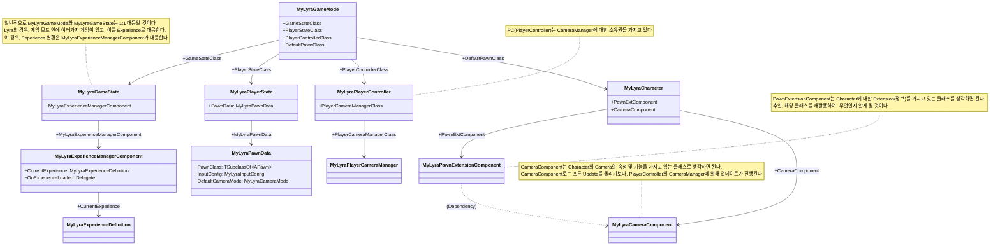

```mermaid
classDiagram
    %% --- 1. 클래스와 멤버 변수를 정의합니다 ---
    class MyLyraGameMode {
        +GameStateClass
        +PlayerStateClass
        +PlayerControllerClass
        +DefaultPawnClass
    }
    class MyLyraGameState {
        +MyLyraExperienceManagerComponent
    }
    class MyLyraPlayerState {
        +PawnData: MyLyraPawnData
    }
    class MyLyraPlayerController {
        +PlayerCameraManagerClass
    }
    class MyLyraCharacter {
        +PawnExtComponent
        +CameraComponent
    }
    class MyLyraExperienceManagerComponent {
        +CurrentExperience: MyLyraExperienceDefinition
        +OnExperienceLoaded: Delegate
    }
    class MyLyraPawnData {
        +PawnClass: TSubclassOf~APawn~
        +InputConfig: MyLyraInputConfig
        +DefaultCameraMode: MyLyraCameraMode
    }
    class MyLyraExperienceDefinition
    class MyLyraPlayerCameraManager
    class MyLyraPawnExtensionComponent
    class MyLyraCameraComponent

    %% --- 2. 클래스 간의 관계를 연결합니다 ---
    MyLyraGameMode --> MyLyraGameState : +GameStateClass
    MyLyraGameMode --> MyLyraPlayerState : +PlayerStateClass
    MyLyraGameMode --> MyLyraPlayerController : +PlayerControllerClass
    MyLyraGameMode --> MyLyraCharacter : +DefaultPawnClass
    
    MyLyraGameState --> MyLyraExperienceManagerComponent : +MyLyraExperienceManagerComponent
    MyLyraExperienceManagerComponent --> MyLyraExperienceDefinition : +CurrentExperience
    
    MyLyraPlayerState --> MyLyraPawnData : +MyLyraPawnData
    
    MyLyraPlayerController --> MyLyraPlayerCameraManager : +PlayerCameraManagerClass
    
    MyLyraCharacter --> MyLyraPawnExtensionComponent : +PawnExtComponent
    MyLyraCharacter --> MyLyraCameraComponent : +CameraComponent
    
    MyLyraPawnExtensionComponent ..> MyLyraCameraComponent : (Dependency)

    %% --- 3. 주석(노트)을 추가합니다 ---
    note for MyLyraGameState "일반적으로 MyLyraGameMode와 MyLyraGameState는 1:1 대응일 것이다.<br>Lyra의 경우, 게임 모드 안에 여러가지 게임이 있고, 이를 Experience로 대응한다.<br>이 경우, Experience 변환은 MyLyraExperienceManagerComponent가 대응한다"
    note for MyLyraPlayerController "PC(PlayerController)는 CameraManager에 대한 소유권을 가지고 있다"
    note for MyLyraPawnExtensionComponent "PawnExtensionComponent는 Character에 대한 Extension(정보)를 가지고 있는 클래스를 생각하면 된다.<br>추일, 해당 클래스를 재활용하여, 무엇인지 알게 될 것이다."
    note for MyLyraCameraComponent "CameraComponent는 Character의 Camera의 속성 및 기능을 가지고 있는 클래스로 생각하면 된다.<br>CameraComponent로는 포른 Update를 돌리기보다, PlayerController의 CameraManager에 의해 업데이트가 진행된다"
```